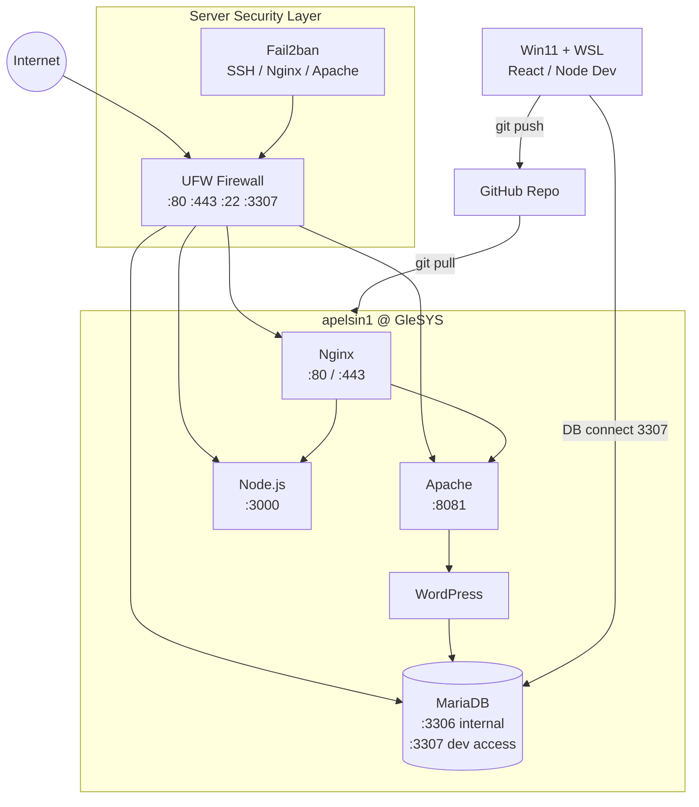

```mermaid
flowchart TD
    Dev[Win11 + WSL\nReact / Node Dev]
    GitHub[GitHub Repo]
    Internet((Internet))

    subgraph Security[Server Security Layer]
        UFW[UFW Firewall\n:80 :443 :22 :3307]
        F2B[Fail2ban\nSSH / Nginx / Apache]
    end

    subgraph Server[apelsin1 @ GleSYS]
        Nginx[Nginx\n:80 / :443]
        Apache[Apache\n:8081]
        Node[Node.js\n:3000]
        WP[WordPress]
        DB[(MariaDB\n:3306 internal\n:3307 dev access)]
    end

    Dev -->|git push| GitHub
    GitHub -->|git pull| Server

    Internet --> UFW --> Nginx
    UFW --> Apache
    UFW --> Node
    UFW --> DB

    F2B --> UFW

    Nginx --> Apache
    Nginx --> Node
    Apache --> WP
    WP --> DB
    Dev -->|DB connect 3307| DB
```
